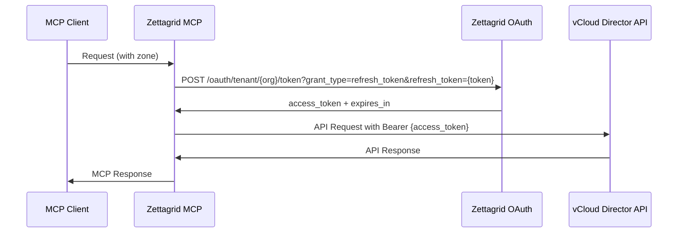

# Zettagrid VMware MCP Server

A comprehensive Model Context Protocol (MCP) server for managing Zettagrid's VMware Cloud Director infrastructure across Indonesian zones. This server enables AI assistants to perform complete tenant organization administration through the Cloud Director API.

## Features

- **Multi-Zone Support**: Manage resources across all Zettagrid Indonesia zones (Jakarta, Cibitung)
- **Comprehensive API Coverage**: Full tenant organization lifecycle management
- **OAuth Authentication**: Secure API token refresh and session management
- **Type-Safe Operations**: Complete TypeScript implementation with vCloud Director schema compliance
- **Error Handling**: Robust retry logic and graceful error recovery
- **Performance Optimized**: Connection pooling, caching, and efficient API usage

## Installation

### Prerequisites

- Node.js 18.0 or later
- npm or yarn package manager
- Valid Zettagrid API token and organization access - See token instructions https://customer.support.zettagrid.com/servicedesk/customer/portal/9/article/1270415361

### Quick Start

1. **Install the package**:
```bash
npm install @zettagrid/vmware-mcp
```

2. **Configure environment variables**:
```bash
cp .env.example .env
# Edit .env with your Zettagrid credentials
```

3. **Run the MCP server**:
```bash
npm start
```

### Development Setup

1. **Clone the repository**:
```bash
git clone https://github.com/zettagrid/zettagrid-vmware-mcp.git
cd zettagrid-vmware-mcp
```

2. **Install dependencies**:
```bash
npm install
```

3. **Configure environment**:
```bash
cp .env.example .env
# Configure your zone credentials (see Configuration section)
```

4. **Build the project**:
```bash
npm run build
```

5. **Run tests**:
```bash
npm test
```

## Configuration

### Environment Variables

Create a `.env` file with your Zettagrid zone configurations:

```bash
# Organization Configuration
ZETTAGRID_ORGANIZATION=your-organization-name
ZETTAGRID_DEFAULT_ZONE=jakarta
ZETTAGRID_API_VERSION=39.1

# Zone API Tokens (configure the zones you need)
ZETTAGRID_API_TOKEN_JAKARTA=your-jakarta-api-token
ZETTAGRID_API_TOKEN_CIBITUNG=your-cibitung-api-token

# Performance Settings (optional)
ZETTAGRID_TIMEOUT=30000
ZETTAGRID_RETRY_ATTEMPTS=3
ZETTAGRID_ENABLE_CACHING=true

# Debug Settings (optional)
DEBUG_LEVEL=info
ZETTAGRID_DEBUG=false
```

**Note**: API and OAuth endpoints are automatically generated based on the standard Zettagrid format:
- API endpoint: `https://mycloud-{zone-code}.zettagrid.id/api`
- OAuth endpoint: `https://mycloud-{zone-code}.zettagrid.id/oauth/tenant/{org}/token`

### All Supported Zones

Configure the following Indonesian zones:

| Zone | API Token Variable | Auto-Generated Endpoint |
|------|-------------------|------------------------|
| Jakarta | `ZETTAGRID_API_TOKEN_JAKARTA` | `https://mycloud-jkt.zettagrid.id/api` |
| Cibitung | `ZETTAGRID_API_TOKEN_CIBITUNG` | `https://mycloud-cbt.zettagrid.id/api` |

## Usage

### Testing Connectivity

Test your configuration with the built-in connectivity test:

```bash
npm run test:connectivity
# or manually:
npx tsx src/examples/connectivity-test.ts
```

This will validate:
- Zone configuration
- Network connectivity  
- OAuth authentication
- Basic API operations
- Health status

### MCP Client Configuration

#### Claude Desktop Configuration

Add the Zettagrid MCP server to your Claude Desktop configuration:

**macOS/Linux**: `~/Library/Application Support/Claude/claude_desktop_config.json`
**Windows**: `%APPDATA%\Claude\claude_desktop_config.json`

```json
{
  "mcpServers": {
    "zettagrid-vmware": {
      "command": "node",
      "args": ["/path/to/zettagrid-vmware-mcp/build/index.js"],
      "env": {
        "ZETTAGRID_ORGANIZATION": "your-organization-name",
        "ZETTAGRID_DEFAULT_ZONE": "jakarta",
        "ZETTAGRID_API_VERSION": "39.1",
        "ZETTAGRID_API_TOKEN_JAKARTA": "your-jakarta-token",
        "ZETTAGRID_TIMEOUT": "30000",
        "ZETTAGRID_RETRY_ATTEMPTS": "3",
        "ZETTAGRID_ENABLE_CACHING": "true",
        "DEBUG_LEVEL": "info"
      }
    }
  }
}
```

#### Cursor MCP Configuration

Configure Cursor to use the Zettagrid MCP server by adding to your Cursor settings:

**Cursor Settings** → **Extensions** → **MCP Servers**

```json
{
  "mcp.servers": {
    "zettagrid-vmware": {
      "command": "node",
      "args": ["/path/to/zettagrid-vmware-mcp/build/index.js"],
      "env": {
        "ZETTAGRID_ORGANIZATION": "your-organization-name",
        "ZETTAGRID_DEFAULT_ZONE": "jakarta",
        "ZETTAGRID_API_VERSION": "39.1",
        "ZETTAGRID_API_TOKEN_JAKARTA": "your-jakarta-token",
        "ZETTAGRID_TIMEOUT": "30000",
        "ZETTAGRID_RETRY_ATTEMPTS": "3",
        "ZETTAGRID_ENABLE_CACHING": "true",
        "DEBUG_LEVEL": "info"
      }
    }
  }
}
```

#### Development Mode Configuration

For development with `npm run dev`:

```json
{
  "mcpServers": {
    "zettagrid-vmware-dev": {
      "command": "npx",
      "args": ["tsx", "/path/to/zettagrid-vmware-mcp/src/index.ts"],
      "cwd": "/path/to/zettagrid-vmware-mcp",
      "env": {
        "NODE_ENV": "development"
      }
    }
  }
}
```

#### Multi-Zone Configuration

To configure multiple zones, add all zone credentials to the `env` section:

```json
{
  "env": {
    "ZETTAGRID_ORGANIZATION": "your-organization-name",
    "ZETTAGRID_DEFAULT_ZONE": "jakarta",
    "ZETTAGRID_API_VERSION": "39.1",
    
    "ZETTAGRID_API_TOKEN_JAKARTA": "your-jakarta-token",
    "ZETTAGRID_API_TOKEN_CIBITUNG": "your-cibitung-token",
    "ZETTAGRID_API_TOKEN_JAKARTA": "your-jakarta-token",
  }
}
```

### MCP Server Integration

The server provides comprehensive MCP tools for cloud management:

#### Organization Management
- `list_organizations` - List all accessible organizations
- `get_organization` - Get organization details and settings
- `update_organization_settings` - Modify organization configuration

#### Virtual Data Center (VDC) Operations
- `list_vdcs` - List virtual data centers
- `get_vdc` - Get VDC details and capabilities
- `show_vdc_resources` - Show VDC resource allocation and usage table (RAM, vCPU, Storage)
- `get_vdc_compute_policies` - Retrieve compute policies and limits

#### vApp Lifecycle Management
- `list_vapps` - List virtual applications
- `get_vapp` - Get vApp configuration and status
- `power_on_vapp` - Start vApp
- `power_off_vapp` - Stop vApp
- `deploy_vapp` - Deploy vApp from template

#### Virtual Machine Operations
- `list_vms` - List virtual machines
- `get_vm` - Get VM details and configuration
- `power_on_vm` - Start virtual machine
- `power_off_vm` - Stop virtual machine
- `get_vm_console` - Get VM console access ticket

#### Storage Management
- `list_disks` - List independent disks
- `create_disk` - Create new storage disk
- `attach_disk` - Attach disk to VM

#### Network Configuration
- `list_org_networks` - List organization networks
- `create_org_network` - Create organization network

#### Firewall and Security
- `list_edge_gateways` - List edge gateways
- `get_edge_gateway` - Get edge gateway details and configuration
- `list_firewall_rules` - List firewall rules for an edge gateway
- `create_firewall_rule` - Create new firewall rule

### API Client Usage

Use the Zettagrid client directly in your applications:

```typescript
import { ZettagridClient } from '@zettagrid/vmware-mcp';

const client = new ZettagridClient();

// List organizations
const orgs = await client.listOrganizations('jakarta');
console.log(orgs.data);

// Get VDCs  
const vdcs = await client.listVdcs('jakarta');
console.log(vdcs.data);

// Zone information
const zoneInfo = await client.getZoneInfo('jakarta');
console.log(zoneInfo.data);
```

## Authentication

### OAuth Token Refresh Flow

The server implements Zettagrid's OAuth authentication flow:

1. **API Token**: Your initial Zettagrid API token
2. **Token Refresh**: Automatically exchanges the API token for an access token via OAuth
3. **Session Management**: Maintains authenticated sessions with automatic refresh
4. **Multi-Zone**: Independent authentication per zone

### Authentication Process



## Zone Management

### Multi-Zone Operations

The server supports operations across multiple zones:

```typescript
// Default zone operation
const vdcs = await client.listVdcs();

// Specific zone operation  
const vdcsJakarta = await client.listVdcs('jakarta');
const vdcsCibitung = await client.listVdcs('cibitung');

// Zone information
const zones = client.getZoneInfo();
console.log(zones.data.availableZones); // ['jakarta', 'cibitung']
```

### Zone Health Monitoring

```typescript
// Test zone connectivity
const healthCheck = await client.getHealthStatus();
console.log(healthCheck.data);

// Test specific zone
const zoneTest = await client.testZone('jakarta');
console.log(zoneTest.data);
```

## Error Handling

The server implements comprehensive error handling:

### Automatic Retry
- Network failures: 3 retry attempts with exponential backoff
- Rate limiting: Automatic backoff and retry
- Token expiration: Automatic re-authentication

### Error Types
- `ZONE_TEST_ERROR` - Zone connectivity issues
- `GET_ORGANIZATION_ERROR` - Organization access problems  
- `LIST_VDCS_ERROR` - VDC enumeration failures
- `POWER_ON_VAPP_ERROR` - vApp power operation failures

### Error Response Format
```json
{
  "success": false,
  "error": {
    "code": "GET_VDC_ERROR",
    "message": "Failed to get VDC",
    "details": { ... }
  },
  "metadata": {
    "zone": "jakarta",
    "organization": "Org_cloud1100009", 
    "timestamp": "2025-06-19T14:58:05.809Z"
  }
}
```

## Security

### Best Practices
- **Environment Variables**: Store all credentials in environment variables
- **Token Security**: API tokens are automatically refreshed and never logged
- **HTTPS Enforcement**: All communications use HTTPS/TLS
- **Zone Isolation**: Authentication is isolated per zone
- **Audit Logging**: All operations are logged for security auditing

### Credential Management
- Never commit API tokens to version control
- Use different tokens per environment (dev/staging/prod)
- Rotate API tokens regularly
- Monitor token usage and access logs

## Troubleshooting

### Common Issues

#### Authentication Failures
```bash
# Check token validity
curl -X POST "https://mycloud-jkt.zettagrid.id/oauth/tenant/YourOrg/token?grant_type=refresh_token&refresh_token=YourToken" \
  -H "Accept: application/json"
```

#### Zone Connectivity Issues
```bash
# Test zone endpoint
npm run test:connectivity
```

#### Environment Configuration
```bash
# Validate environment variables
node -e "console.log(process.env.ZETTAGRID_API_TOKEN_PERTH ? 'Token configured' : 'Token missing')"
```

### Debug Mode

Enable detailed logging:
```bash
DEBUG_LEVEL=debug ZETTAGRID_DEBUG=true npm run dev
```

### Support

- **Zettagrid**: This MCP server is not officially supported by Zettagrid and provided with warranties of no kind.
- **Documentation**: This readme.md
- **Issues**: Report bugs via GitHub Issues
- **Community**: Join the discussion in GitHub Discussions

## License

MIT License - see [LICENSE](LICENSE) file for details.

## Changelog

### v1.0.0 (2025-06-19)
- Initial release
- Multi-zone support for Zettagrid Indonesia zones (Jakarta, Cibitung)
- OAuth authentication with automatic token refresh
- Comprehensive vCloud Director API coverage
- TypeScript implementation with full type safety
- Live testing against Jakarta zone infrastructure
- Complete MCP tool suite for cloud management

---

**Zettagrid VMware MCP Server** - Comprehensive cloud infrastructure management through AI assistants.
